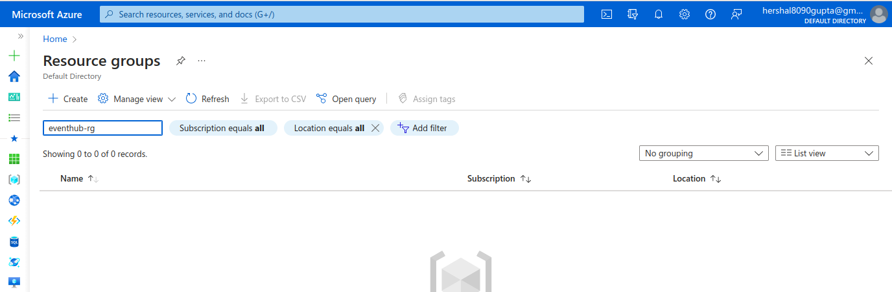
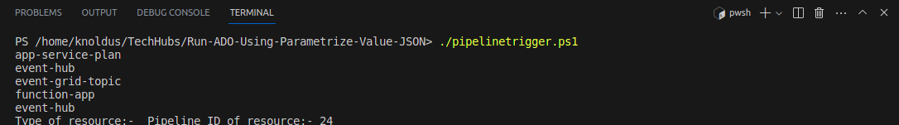
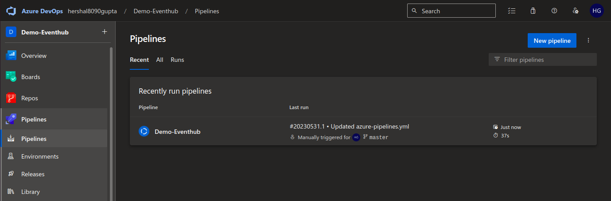
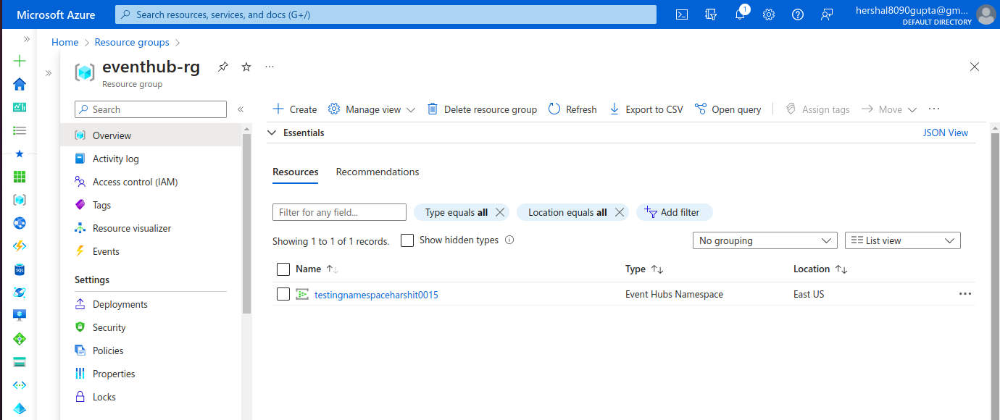

# Short Description about this template
This powershell script helps you to trigger the ADO pipeline with parameters value.

In this techhub we are reading the parameter value from the JSON file and passing to the ADO pipeline , this will create a tf.vars file for terraform module

# Steps for Execution 
1. clone the repository  
2. go to the terminal where we can run the powershell script.
3. ./pipelinetrigger.ps1

As you can see in the below image there is no resource type of eventhub-rg .

After run the powershell script from terminal

This will call the ADO pipeline and create the .tfvars file and run the terraform module.In this case we creating a eventhub module inside creating a namespace, the name of the namespace reading from the JSON file.As show in the below image there is pipeline trigger and created the namespace.

